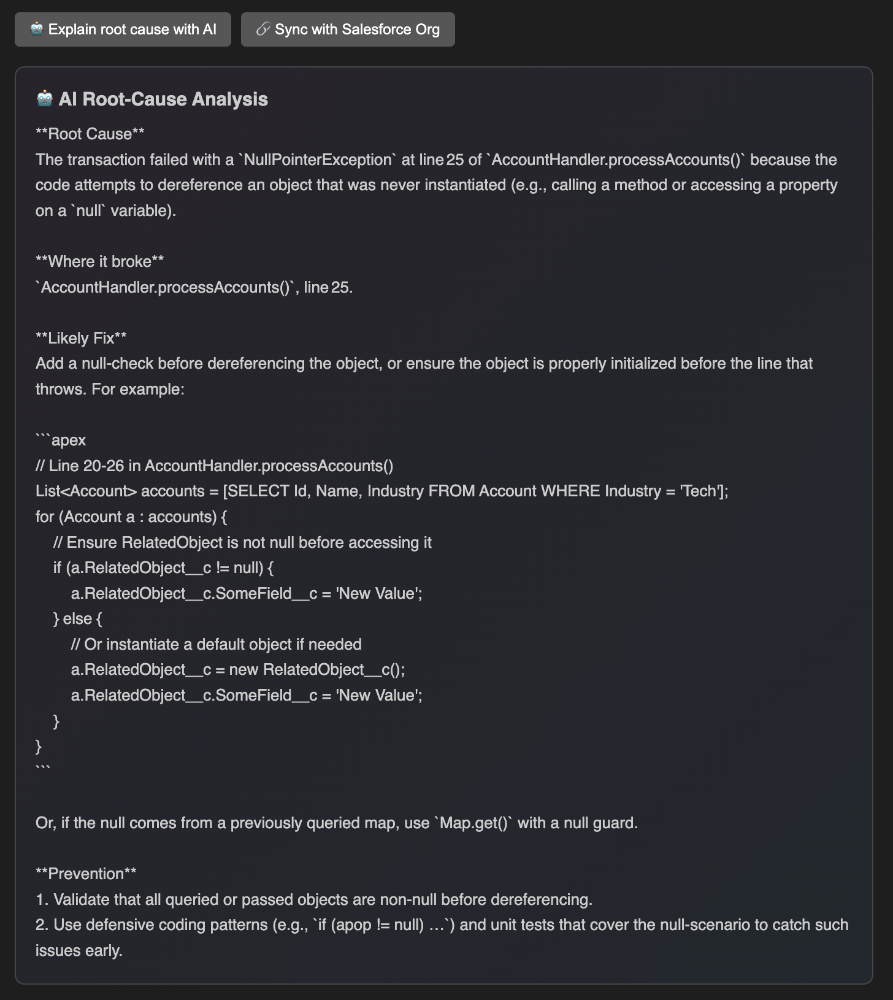
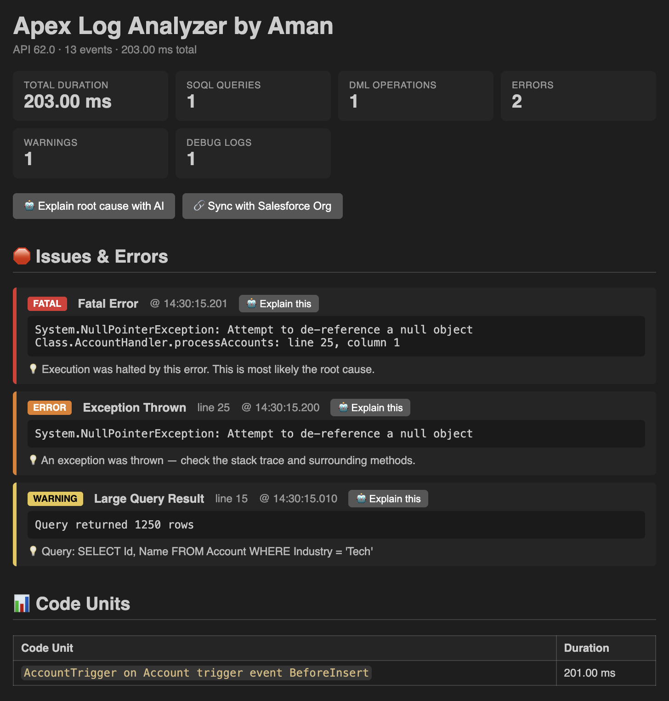
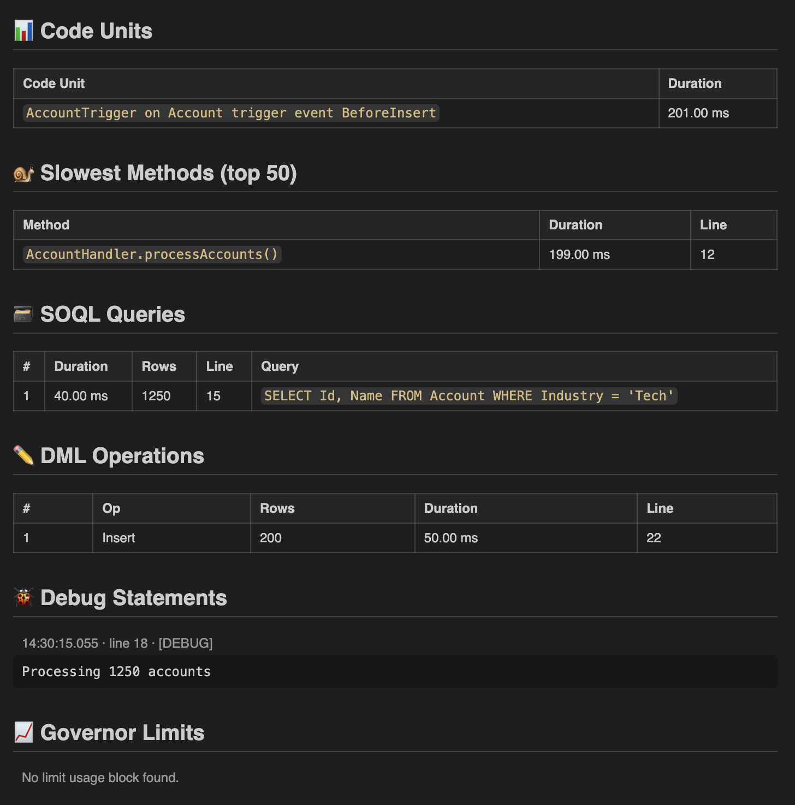

# Apex Log Analyzer by Aman

> A VS Code extension that parses and analyses Salesforce Apex debug logs — with AI-powered root-cause explanations.



---

## ✨ What it does

Paste any Salesforce Apex debug log into VS Code, right-click, and get an instant, structured breakdown:

- 🛑 **Issues & errors** — fatal errors, exceptions, governor-limit violations
- 📊 **Code units** — every trigger, workflow, and execution entry point with timing
- 🐌 **Slowest methods** — top 50 methods ranked by duration
- 🗃️ **SOQL queries** — every query, row count, and execution time
- ✏️ **DML operations** — inserts, updates, deletes with row counts
- 🐞 **Debug statements** — all `System.debug()` output
- 📈 **Governor limits** — cumulative usage snapshot

---

## 🤖 AI-assisted root-cause analysis

One click and the AI explains exactly **what went wrong, where it broke, and how to fix it** — in plain English, with working Apex code suggestions.





The response is structured into four sections:

- **Root Cause** — what actually went wrong, in plain English
- **Where it broke** — the class, method, and line number
- **Likely Fix** — concrete recommendation with an Apex code snippet
- **Prevention** — practices to prevent this class of issue recurring

**Per-issue focus**: click "Explain this" next to any detected issue to get focused analysis of just that problem.

---

## 🚀 Getting started

```bash
git clone https://github.com/amanparate/apex-log-analyzer-by-aman.git
cd apex-log-analyzer-by-aman
npm install
npm run compile
```

Open the folder in VS Code and press **F5** to launch the Extension Development Host.

### Using it

1. Open any file containing an Apex debug log
2. Right-click in the editor → **"Analyse this Apex Log"**
3. The analysis panel opens beside your log
4. Click **"🤖 Explain root cause with AI"** for AI insights

---

## 🔑 Setting up the AI feature

Pick one provider:

### Option A: OpenRouter (FREE — recommended for testing)

1. Sign up at [openrouter.ai](https://openrouter.ai) (no credit card required)
2. Get a free API key at [openrouter.ai/keys](https://openrouter.ai/keys)
3. Click the AI button in the extension and paste your key (starts with `sk-or-`)

Default model uses OpenRouter's free auto-router. Rate limit: ~20 requests/minute, 200/day.

### Option B: Anthropic Claude (paid, higher quality)

1. Get an API key at [console.anthropic.com](https://console.anthropic.com)
2. In VS Code settings, change `apexLogAnalyzer.provider` to `anthropic`
3. Change `apexLogAnalyzer.model` to `claude-sonnet-4-5`
4. Run **"Apex Log Analyzer: Clear LLM API Key"** then enter your new key

### 🔒 Security

API keys are stored in VS Code's encrypted `SecretStorage` — never in `settings.json`, never in source.

### 🛡️ Privacy

The extension sends a **distilled summary** to the LLM (detected issues, relevant debug statements, slowest methods, SOQL queries) — not the raw log. If your logs contain sensitive data, review the `buildContext()` method in `src/aiService.ts` and redact/filter as needed before sharing this with a team.

---

## 🔗 Salesforce Org sync (optional)

Sync the extension with your org to identify which user executed a given log.

Requires the Salesforce CLI installed and authenticated:

```bash
sf org login web
sf config set target-org=<your-alias>
```

Then click **"Sync with Salesforce Org"** in the analysis panel.

---

## ⚙️ Settings

| Setting                     | Default           | Description                                      |
| --------------------------- | ----------------- | ------------------------------------------------ |
| `apexLogAnalyzer.provider`  | `openrouter`      | `openrouter` (free) or `anthropic` (paid)        |
| `apexLogAnalyzer.model`     | `openrouter/free` | Model ID. Use `claude-sonnet-4-5` for Anthropic. |
| `apexLogAnalyzer.maxTokens` | `1500`            | Max tokens for AI response                       |

---

## 📦 Packaging as a .vsix

```bash
npm install -g @vscode/vsce
vsce package
```

Produces a `.vsix` file you can install via VS Code → Extensions → **Install from VSIX**.

---

## 🛠️ Tech stack

- **TypeScript** (strict mode)
- **esbuild** for fast bundling
- **Node.js `https`** — zero runtime dependencies for API calls
- **VS Code Webview API** for themed panel rendering
- **VS Code SecretStorage** for encrypted credentials
- **Salesforce CLI (`sf`)** for optional org sync

---

## 📝 License

MIT — see [LICENSE](LICENSE) for details.

---

## 💙 Author

Built by [Aman Parate](https://github.com/amanparate).

Feedback, issues, and pull requests welcome!
